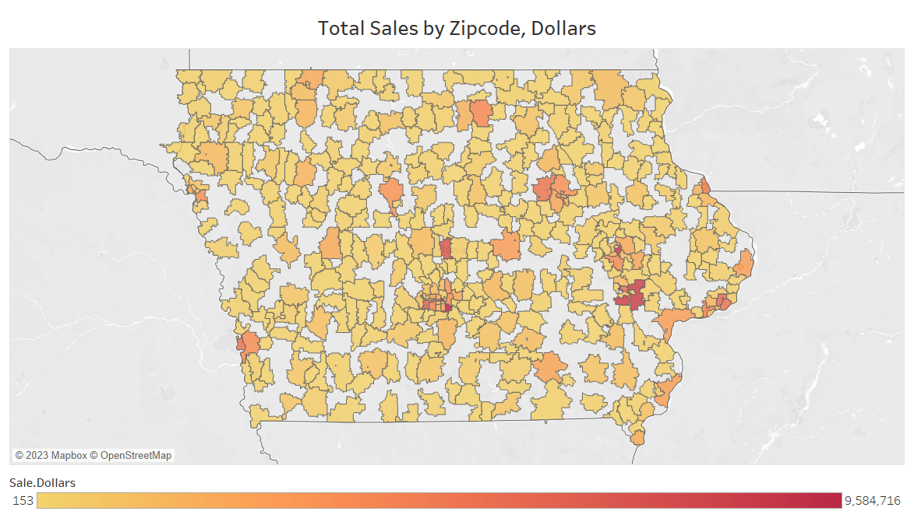

```{r Load Packages, echo=FALSE, message=FALSE}
library(readr)
library(dplyr)
library(tidyverse)
library(stargazer)
library(ggplot2)
```

```{r Import Data, echo=FALSE}
#Import Datasets
cities   = "https://raw.githubusercontent.com/schmidsp-bc/SoftwareTools_Team3/Team3_Checkpoint%232/project.cities.csv"
counties = "https://raw.githubusercontent.com/schmidsp-bc/SoftwareTools_Team3/Team3_Checkpoint%232/project.counties.csv"
zipcodes = "https://raw.githubusercontent.com/schmidsp-bc/SoftwareTools_Team3/Team3_Checkpoint%232/project.zipcodes.csv"
cities   <- read_csv(url(cities),   show_col_types = FALSE)
counties <- read_csv(url(counties), show_col_types = FALSE)
zipcodes <- read_csv(url(zipcodes), show_col_types = FALSE)

# Create Total Datasets
cities.total.sales   <- cities %>% select(city, income, sale.dollars, sale.volume, population)
cities.total.sales   <- cities.total.sales %>%
  group_by(city) %>%
  summarize(total.sales.dollars = sum(sale.dollars), 
            total.sales.volume  = sum(sale.volume), 
            income              = median(income),
            population          = median(population))

counties.total.sales <- counties %>% select(county, income, sale.dollars, sale.volume, population)
counties.total.sales <- counties.total.sales %>%
  group_by(county) %>%
  summarize(total.sales.dollars = sum(sale.dollars),
            total.sales.volume  = sum(sale.volume), 
            income              = median(income),
            population          = median(population))

zipcodes.total.sales <- zipcodes %>% select(zipcode, income, sale.dollars, sale.volume, population)
zipcodes.total.sales <- zipcodes.total.sales %>%
  group_by(zipcode) %>%
  summarize(total.sales.dollars = sum(sale.dollars), 
            total.sales.volume  = sum(sale.volume), 
            income              = median(income),
            population          = median(population))
```

Our analysis firm was tasked with an assignment from a prominent chain of liquor stores in the state of Iowa. Through our work with this firm, we were asked to conduct an analysis of liquor sales to determine whether it would be a smarter business decision to invest in stock of high-end or low-end liquor in the firm's stores. We used sales data from the firm combined with socioeconomic data from the American Community Survey to determine if income is in any way related to liquor sales. Our theory is that if high-income communities make up a larger portion of the liquor sales, the firm should stock more high-end liquor brands to appeal too that clientele. If low-income communities consumer more liquor, the firm should invest in the low-end liquor brands. In order to have more direction for this decision, we have decided to answer the following questions:

-   Do geographies with higher median income consume more alcohol in total?
-   Does it change if we look at per-capita sales?
-   Does the result vary among liquor categories?

As economists, we will look at the correlation between the income of the state of Iowa and the total sales of liquor in dollars. Based on the correlation between sales and income dynamics, we will make a policy recommendation for the firm regarding which class of liquor they should stock. This decision will also have a benefit to the community as the products that are sold will be more tailored to the income demographic of the area. This should increase the quality of living and allow for the business to prosper no matter which demographic is highly correlated.

#### Data Summary

To answer our research question and provide our recommendation, we utilized two datasets. First, we used a dataset on liquor sales in Iowa, which included variables on sales in both dollars and volume across liquor categories. The dataset is typically used for market research and analysis to gain insight into consumer behavior, preferences, and trends. The second dataset we utilized came from the American Community Survey [ACS] and include demographic and socioeconomic variables for regions across the state of Iowa, including racial variables, education indicators, and median income. Both datasets were measured across three different geographic metrics: counties, cities, and zipcodes. We merged these two datasets across each geographic metric, resulting in three data frames that included liquor sales and demographic data for Iowa counties, cities, and zipcodes. The goal of the inclusion of demographic and economic data was to provide a more comprehensive analysis of the factors that may influence alcohol sales.

By using the demographic and economic data as independent variables and the sales data as dependent, we can view and analyze the relationship between the socioeconomic factors and liquor consumption. In this particular case, we are looking for a correlation between income levels and alcohol sales across the different geographic metrics.

Descriptive statistics can be used to summarize the data and identify patterns or trends in liquor sales. We use measures of central tendency (e.g., mean, median) and measures of variables (e.g., sales, geographic range, and revenue) to provide a general understanding of the data set and identify any potential outliers or significant trends.

```{r Descriptive Stats, echo=FALSE}
stargazer(as.data.frame(cities),   type = "text", title = "Iowa Cities Dataset")
stargazer(as.data.frame(counties), type = "text", title = "Iowa Counties Dataset")
stargazer(as.data.frame(zipcodes), type = "text", title = "Iowa Zipcodes Dataset")
```

We provided descriptive statistics for the three data frames that resulted from the merging of the data. One point to note is the difference in the number of observations between the three data frames. Since we are looking at three different geographic metrics, there are differences in the number of observations of the three groups.

One of the limitations of this dataset for our research is that it is a general view of liquor sales across the whole state and does not provide information on where the sales are occurring. Since we are focused on a particular chain of liquor stores, using the data may not provide the most applicable and accurate results. The relationship between socioeconomic factors and alcohol sales may vary depending on the location of the store. Therefore, it is important to acknowledge and consider this limitations of the data when conducting the analysis. We should also attempt to collect additional data, such as store location information and sales from this particular chain, to improve the accuracy and ablicability of our analysis and recommendation.

#### Data Analytics

To determine our policy recommendation, we created a series of visualizations of the data. We analyzed each data set independently and then merged the data sets to answer our research questions.

We first looked at the Iowa Liquor Sales data. Across each geographic metric, we created map visualizations that show the total dollar sales of liquor. We also looked into the areas with the top and bottom dollar sales. Since our research parameters specified to look across geographies, we included analysis of all geographic metrics despite showing similar results in each.


The above visualization displays dynamics of sales across the county metric. The map shows that the majority of counties have a similar amount of sales with a few outliers - notably, the counties that represent the top and bottom sellers.


There appears to be more variance in sales across the city geographic level than the county level. Between the two graphs, there is expected overlap with top selling cities laying within top selling counties. Notably, the top selling county contains the top selling capital city, Des Moines.



The total sales by zipcodes are shown in the map above. This view gives a more detailed view of the sale dynamics across the state of Iowa. One noteworthy point from this map is the small geographic area that covers the top selling region of the state, Des Moines. One recommendation for the liquor store firm would be to target the Des Moines market if not already doing so.

Within the liquor sales data, we were also interested in the dynamics of sales between the different liquor categories.  The top two selling liquors, whisky and vodka, account for over half of all the sales across the state. This makes these two liquors especially important to the analysis. The ranking of category sales in dollars and volume are identical except for the reversal of gin and brandy between the two. Gin comprises less of the total sales in dollars than it does of total sales in volume, which shows that it is likely a cheaper liquor.

Since we used the income data from the American Community Survey, we analyzed income across the geographic metrics.


The map of median income by county creates a nice visualization to compare to the sales map above. The highest and lowest income counties do not have any overlap with the top and bottom selling counties, which could be indicative that we will not find any relationship with which to base our policy recommendation.


Similar to the county dynamics, there is no overlap between the high and low income cities with the top and bottom selling cities.

We also wanted to explore if there are any factors that impact the median income and would therefore influence our analysis. Specifically, we looked into if there is a correlation between the unemployment rate and median income. The theory behind this was that if there is a higher unemployment rate in low-income areas, this could falsely show that lower incomes is related to lower sales. Instead, the real relationship could be between sales and unemployment rate. This would be logical, since a higher unemployment rate could mean that people do not want to spend money on non-necessities like alcohol.

```{r Umemployment_Income, echo=FALSE, message=FALSE, warning=FALSE}
par(mfrow=c(2,2))
ggplot(counties, aes(x = unemployment, y = income)) +
  geom_point() +
  geom_smooth(color="darkgrey") +
  ggtitle("Unemployment vs Median Income, Counties") +
  xlab("Unemployment Rate") +
  ylab("Median Income, USD") +
  theme_gray() + 
  theme(plot.title = element_text(hjust = 0.5))
```

For simplicity, we focused on the county level for this examination. This plot shows what we predicted, which is that higher unemployment rates correlate with lower median incomes. If our analysis indicates that there are lower alcohol sales in lower-income regions, this could be a possible explanation to explore.

To determine our recommendation for the liquor store, we looked at the correlation between income and sales. This was done with the goal of determining if high or low median incomes are correlated with greater sales. To have a thorough analysis, we looked across different geographic metrics.

```{r County_total, echo=FALSE, message=FALSE, warning=FALSE}
ggplot(counties.total.sales, aes(x = income, y = total.sales.dollars)) +
  geom_point() +
  geom_smooth(color="darkgrey") +
  scale_y_log10() +
  ggtitle("Total Sales vs Income, Counties") +
  xlab("Median Income") +
  ylab("Log of Total Sales, Dollars") +
  theme_gray() + 
  theme(plot.title = element_text(hjust = 0.5))
```

Based on the smoothed line on this scatterplot, there appears to be a slight correlation with increase liquor sales at high and low median incomes. However, there confidence intervals of the smooth line widens at these indicates, indicating that the fit of this line is likely not significant. Therefore, we cannot determine that there is a relationship between these variables from this model alone.

```{r City_total, echo=FALSE, message=FALSE, warning=FALSE}
ggplot(cities.total.sales, aes(x = income, y = total.sales.dollars)) +
  geom_point() +
  geom_smooth(color="darkgrey") +
  scale_y_log10() +
  ggtitle("Total Sales vs Income, Cities") +
  xlab("Median Income") +
  ylab("Log of Total Sales, Dollars") +
  theme_gray() + 
  theme(plot.title = element_text(hjust = 0.5))
```

Similarly, on the city geographic level, there does not appear to be any significant relationship between median income and alcohol sales. There is a slight upward curve towards lower incomes, which could support that there is a slight correlation between lower median incomes and increased liquor sales, which is supported by the county graph.

```{r Zipcode_total, echo=FALSE, message=FALSE, warning=FALSE}
ggplot(zipcodes.total.sales, aes(x = income, y = total.sales.dollars)) +
  geom_point() +
  geom_smooth(color="darkgrey") +
  scale_y_log10() +
  ggtitle("Total Sales vs Income, Zipcodes") +
  xlab("Median Income") +
  ylab("Log of Total Sales, Dollars") +
  theme_gray() + 
  theme(plot.title = element_text(hjust = 0.5))
```

The zipcode plot reaffirms that there could be correlation between lower incomes and liquor sales, although this graph has an additional downward curve and large confidence intervals.

From these plots, we conclude that there is potential evidence of a slight relationship between lower median incomes and increased liquor sales. However, we want to gather more evidence to support this and analyize the additional sections of our research question.

Accounting for population gives a more accurate view of the link between liquor sales and income, since differences in population could be changing or masking any effects.

```{r, message = FALSE, warning=FALSE, echo=FALSE}
ggplot(counties.total.sales, aes(x = population, y = total.sales.dollars)) +
  geom_point() +
  scale_y_log10() +
  geom_smooth(se =FALSE, color = "blue") +
  ggtitle("Population vs Total Sales, Counties") +
  xlab("Population") +
  ylab("Log of Total Sales, Dollars") +
  theme_gray() + 
  theme(plot.title = element_text(hjust = 0.5))
```

The above chart shows the linear relationship between population and liquor sales, which highlights the need to control for this. To do so, we found the dollar sales of liquor per-capita across each geographic metric. This will allow us to refine our earlier results and give the best possible recommendation.

```{r,warning=FALSE,message=FALSE,echo=FALSE}
ggplot(counties.total.sales, aes(x = income, y = total.sales.dollars/population)) +
  geom_point() +
  geom_smooth(color="darkgrey") +
  ggtitle("Per-Capita Sales vs Income, Counties") +
  xlab("Median Income") +
  ylab("Per-Capita Sales, Dollars") +
  theme_gray() + 
  theme(plot.title = element_text(hjust = 0.5))
```

At the county level, controlling for population removes the slight upward curve at the lower income range. Compared to the previous graph of total sales versus median income for counties, this chart has less variance in the best fit line. Aside from the high-income outlier, there appears to be no relationship between income and sales.

```{r,warning=FALSE,message=FALSE,echo=FALSE}
ggplot(cities.total.sales, aes(x = income, y = total.sales.dollars/population)) +
  geom_point() +
  geom_smooth(color="darkgrey") +
  ggtitle("Per-Capita Sales vs Income, Cities") +
  xlab("Median Income") +
  ylab("Per-Capita Sales, Dollars") +
  theme_gray() + 
  theme(plot.title = element_text(hjust = 0.5))
```

At the city level, the relationship between per-capita sales and income mirrors the relationship between total sales and income. This plot reinforces the link between lower-income and increased liquor sales.

```{r,warning=FALSE,message=FALSE,echo=FALSE}
ggplot(zipcodes.total.sales, aes(x = income, y = total.sales.dollars/population)) +
  geom_point() +
  geom_smooth(color="darkgrey") +
  ggtitle("Per-Capita Sales vs Income, Zipcodes") +
  xlab("Median Income") +
  ylab("Per-Capita Sales, Dollars") +
  theme_gray() + 
  theme(plot.title = element_text(hjust = 0.5))
```

Similarly, the same chart at the zipcode geographic level mirrors the total sales chart and supports that the relationship exists.

To complete our analysis, we wanted to see of this relationship is present or more pronounced among the different liquor categories. For simplicity, we looked only at the county geographic level.


The chart containing all categories, while very busy, does not indicate that any one category shows any significant relationship with income. For the top selling liquors, whisky and vodka, we included individual charts. These charts mirror the total sales graphs and do not indicate that either of the liquors are consumed differently across median incomes.

Overall, our analysis shows that low-income groups purchase more alcohol both in total and per-capita. However, the relationship does not hold true across all geographic levels and, if it exists, is very slight. Since it is the only evidence of any relationship we have found, we will use it to inform our policy recommendation, but it should be held with a bit of skepticism.

An worthy excursion from this analysis would be to narrow down our research to regions that are directly served by this liquor store firm. If we had data on where this firm has store locations, we could narrow down to only those areas and better represent the relationship between their sales and clientele. This would also be improved if we had data on this firm's sale in particular and not sales across the entire state. With this data, we could form a better recommendation based solely on this firm's unique scenario.

To create our visualizations for this analysis, we used both R and Tableau software. Both of these programs have advantages and challenges. The advantage of using the R software is that it is easy to analyze the data without visualizations, such as with the descriptive statistics provided in our data summary. Additionally, the R software has more analysis power that allowed us to create a better statistical examination of the data. For example, we were able to easily add the smoothed mean lines to our plots, which is difficult in Tableau. The disadvantage to R is that it has a bigger learning curve than Tableau, since it requires actual coding. It is also very easy to make simple mistakes that stop the code from running completely, especially as beginners.

The advantage of using Tableau software is that we were able to create a larger variety of visualizations that are not possible or our above our skill level in R. For instance, since we are looking at geographic metrics, it was intuitive to include map visualizations, which would not be possible if only using R software. An additional benefit of Tableau is that it is very easy to make visualizations aesthetically pleasing compared to R. For example, to assign colors to the bars on a bar graph in Tableau, we simply looked through the various color palettes. In R, we would have had to code to manually assign each color to the different bars. The disadvantage of Tableau is that it is difficult to work with the data statistically.

### Conclusion

Through the research we conducted utilizing this data, we are able to conclude that overall, there is no significant relationship between income and total liquor sales. There may be a slight relationship between lower income and total liquor sales, as is shown in in the visualization of liquor sales versus income at the city and zipcode geographic metrics. We found that this relationship exists with both total sales and per-capita sales. We also found that separating by liquor category does not show any different patterns. However, these results are based on the curve of the smoothed means line, which has a wide confidence interval, indicating that we should be skeptical of these results.

The unavailability of data about the sales and locations of our decision maker's liquor store chain limits the results of this data. If we could narrow down our research to include only regions that the chain serves and look at their specific sales, we would be able to create a better model based on their specific clientele. Additionally, if we had information on the price of liquor being sold, we would be able to make a better recommendation. If we knew how much is being spent on high-end or low-end liquor in each area, we could better formulate a recommendation.

There are many other areas of future research that would align with this report. We could look into other factors that impact liquor sales, such as education metrics. We could also recreate this research across different states to see if our results hold up or are changed. Finally, for simplicity, we could narrow our focus down to one geographic area and control for other factors. If we created a linear model from this data that used liquor sales as the dependent variable and income as the key explanatory variable, we could include the other demographic factors and liquor category as controls. This would allow us to quantify the relationship between the two variables, instead of simply speculating based on visualizations.

### Policy Recommendation

The decision maker from the Iowa liquor store chain is facing a decision of whether to invest in additional stock of high-end or low-end liquor. We were tasked with analyzing the sales of liquor across the state to determine if income plays a role. If low-income areas purchase more alcohol, then we would recommend stocking more low-end liquor to appeal to that clientele. Conversely, if high-income areas purchase more alcohol, we would recommend stocking more high-end liquor to appeal to that base.

Overall, we believe that there is no trend to indicate how to stock the shelves of the liquor stores; across all geographic metrics, there was very little pattern to indicate that either income group purchases significantly more alcohol. There is a slight indication that low-income regions purchase marginally more alcohol, but it should be noted that this trend lies with an large confidence interval and that there is room for error. Therefore, our recommendation is that the liquor store may see slightly better sales if they increase their stock of low-end liquor due to this slight relationship, but that investing in a significant amount of this stock may not provide any real benefits.

If the chain decides to follow this recommendation and slightly increases stock of low-end liquor, the short term effect may be higher sales in low-income regions. The long term effect of this could be that the firm will open more stores in these regions and shift to serve a specific client-base of low-income consumers instead of all income groups. Alternatively, if are model did present a relationship that does not exist, there may be no short term effects of this decision, resulting in no long term changes. Since we recommend only slightly increasing the stock of low-end liquor, the biggest risk is losing out on that investment if the liquor does not sell. The benefit of this recommendation is that, if our analysis correctly identified the relationship, the stock will sell well, which could indicate that the firm should continue to invest in stocking more low-end alcohol to continue serving that market and increase their profits.
