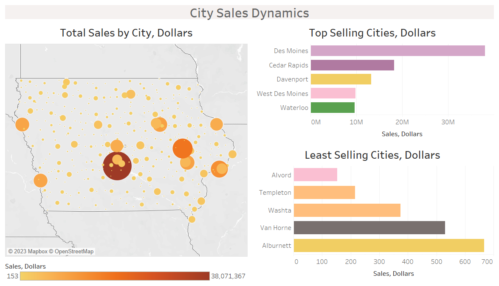
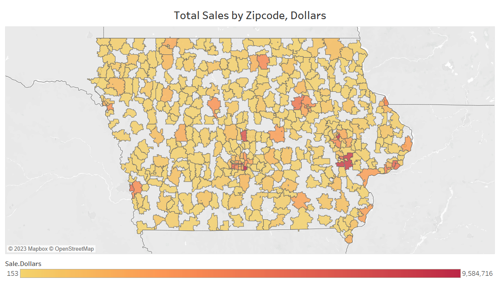
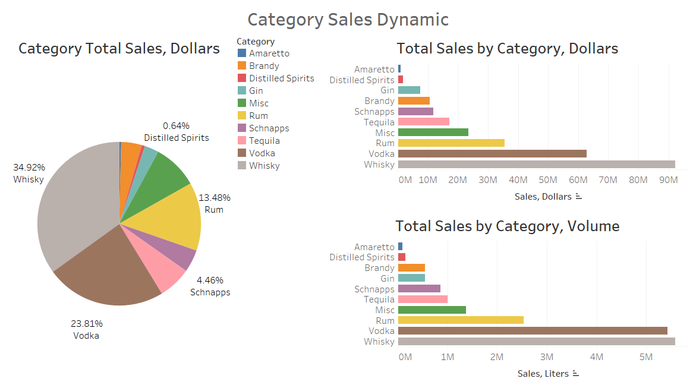
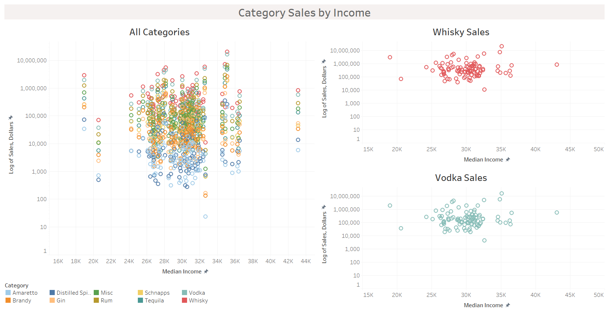

Our analysis firm was tasked with an assignment from a prominent chain
of liquor stores in the state of Iowa. Through our work with this firm,
we were asked to conduct an analysis of liquor sales to determine
whether it would be a smarter business decision to invest in stock of
high-end or low-end liquor in the firm’s stores. We used sales data from
the firm combined with socioeconomic data from the American Community
Survey to determine if income is in any way related to liquor sales. Our
theory is that if high-income communities make up a larger portion of
the liquor sales, the firm should stock more high-end liquor brands to
appeal too that clientele. If low-income communities consumer more
liquor, the firm should invest in the low-end liquor brands. In order to
have more direction for this decision, we have decided to answer the
following questions:

-   Do geographies with higher median income consume more alcohol in
    total?
-   Does it change if we look at per-capita sales?
-   Does the result vary among liquor categories?

As economists, we will look at the correlation between the income of the
state of Iowa and the total sales of liquor in dollars. Based on the
correlation between sales and income dynamics, we will make a policy
recommendation for the firm regarding which class of liquor they should
stock. This decision will also have a benefit to the community as the
products that are sold will be more tailored to the income demographic
of the area. This should increase the quality of living and allow for
the business to prosper no matter which demographic is highly
correlated.

### Data Summary

    ## 
    ## Iowa Cities Dataset
    ## ==========================================================
    ## Statistic      N      Mean     St. Dev.    Min     Max    
    ## ----------------------------------------------------------
    ## high.school  4,312   91.081      5.496    0.000  100.000  
    ## bachelor     4,312   19.500     10.613    0.000   81.400  
    ## unemployment 4,308   4.509       3.333    0.000  100.000  
    ## income       4,277 30,466.100  6,349.521  6,563   70,625  
    ## population   4,318 5,313.189  16,131.830    0    212,859  
    ## pop.white    4,318 4,715.165  13,285.700    0    164,184  
    ## pop.black    4,318  229.168    1,462.378    0     23,469  
    ## pop.indian   4,318   16.874     87.773      0     1,373   
    ## pop.asian    4,318  143.828     782.095     0     11,722  
    ## pop.hawai    4,318   5.113      28.130      0      338    
    ## pop.other    4,318   82.574     391.759     0     5,109   
    ## pop.multi    4,318  120.468     499.010     0     7,199   
    ## sale.dollars 3,753 70,330.350 381,167.500   1   12,225,234
    ## sale.volume  3,753 4,828.950  25,017.810    0    771,338  
    ## ----------------------------------------------------------

    ## 
    ## Iowa Counties Dataset
    ## ============================================================
    ## Statistic     N     Mean       St. Dev.     Min      Max    
    ## ------------------------------------------------------------
    ## high.school  981   91.110        3.066     78.200   96.300  
    ## bachelor     981   20.772        6.969     11.700   52.400  
    ## unemployment 981    4.265        1.366     1.800    8.400   
    ## income       981 29,982.580    3,220.157   18,959   43,120  
    ## population   981 31,538.630   55,948.790   3,822   459,159  
    ## pop.white    981 28,663.990   47,936.280   3,720   390,415  
    ## pop.black    981  1,049.855    3,625.512     0      29,390  
    ## pop.indian   981   101.107      243.811      0      1,570   
    ## pop.asian    981   677.483     2,258.544     0      18,813  
    ## pop.hawai    981   24.643       65.198       0       366    
    ## pop.other    981   398.238      940.070      0      6,735   
    ## pop.multi    981   623.316     1,489.692     34     12,163  
    ## sale.dollars 990 266,616.000 1,063,977.000   24   20,496,221
    ## sale.volume  990 18,306.090   69,391.760     4    1,288,859 
    ## ------------------------------------------------------------

    ## 
    ## Iowa Zipcodes Dataset
    ## ==========================================================
    ## Statistic      N      Mean     St. Dev.    Min      Max   
    ## ----------------------------------------------------------
    ## zipcode      4,661 51,227.100   918.249   50,001  56,168  
    ## high.school  4,632   91.827      4.895    0.000   100.000 
    ## bachelor     4,632   21.800     10.917    0.000   78.700  
    ## unemployment 4,632   4.138       3.116    0.000   66.700  
    ## income       4,622 31,782.910  6,238.955  2,978   62,005  
    ## population   4,634 6,015.081   8,573.885    0     43,930  
    ## pop.white    4,634 5,426.468   7,488.676    0     40,956  
    ## pop.black    4,634  219.398     632.460     0      6,321  
    ## pop.indian   4,634   17.634     50.310      0      1,033  
    ## pop.asian    4,634  141.235     414.214     0      3,732  
    ## pop.hawai    4,634   5.035      23.811      0       325   
    ## pop.other    4,634   81.526     255.581     0      3,687  
    ## pop.multi    4,634  123.784     237.047     0      1,345  
    ## sale.dollars 4,150 63,602.360 204,219.400   1    2,886,165
    ## sale.volume  4,150 4,367.002  13,426.330    0     185,421 
    ## ----------------------------------------------------------

### Data Analytics

To determine our policy recommendation, we created a series of
visualizations to analyze the

#### Sales Data

 

#### ACS Data

#### Research Question

##### Sales vs Income

##### Per Capita

#### Excursion

#### Advatanges and Challenges

### Conclusion

### Policy Recommendation
